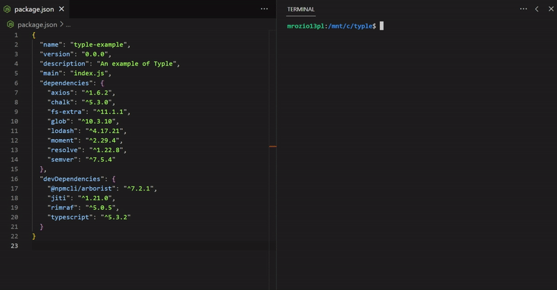

# typle

📦 Scan and install missing Typescript type definitions for dependencies in `package.json`.

[![npm][npm-version]][npm-link]
[![npm bundle size][bundle-size]][bundlephobia]
[![npm bundle size][package-size]][packagephobia]
[![npm download count][download-count]][npm-link]
[![License][license]](./license)

## Docs

Check typle __[docs here](./packages/typle)__.

## Why monorepo?

I decided to split both [typle](./packages/typle) and [typle-core](./packages/typle-core/) into seperate packages, because I might need a package in some other projects that only scans my `package.json` and finds missing typings and I don't want to necessarily install an entire typle library which contains a lot of redundant dependencies.

## License

MIT 💖

<!-- badges -->
[npm-link]: https://npmjs.com/package/typle
[npm-version]: https://img.shields.io/npm/v/typle
[bundle-size]: https://img.shields.io/bundlephobia/min/typle
[bundlephobia]: https://bundlephobia.com/package/typle
[package-size]: https://packagephobia.com/badge?p=typle
[packagephobia]: https://packagephobia.com/result?p=typle
[download-count]: https://img.shields.io/npm/dt/typle
[license]: https://img.shields.io/npm/l/typle